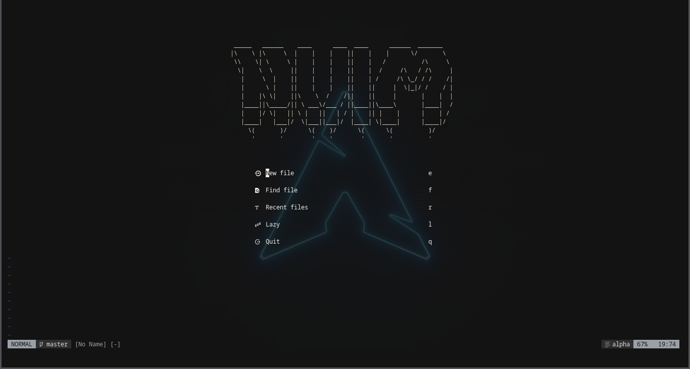

# My Neovim Config

A transparent, warm-charcoal Neovim configuration built for C/C++ and Lua development on modest hardware.



**DISCLAMER** It is recommended to use a terminal that supports transparency to get the best of tthis neovim config visualy.

## Philosophy

My Neovim Config is a hand-rolled config, not a distribution. Every highlight group, every keymap, and every plugin was chosen deliberately. The design goals:

- **Transparent.** No solid backgrounds anywhere. The editor sits on top of your terminal's background, whatever it is.
- **Readable.** A four-tier palette with one cool accent for literals, so code has visual hierarchy without becoming a rainbow.
- **Lightweight.** No animated cursors, no heavy UI plugins, no telemetry. Built with a 4GB machine in mind.
- **C/C++ and Lua first.** LSP, debugging, and keymaps tuned for systems programming and editing this config itself.

## Features

- **Transparent warm-charcoal colorscheme** — hand-written, ~150 lines, no colorscheme plugin
- **LSP** via `nvim-lspconfig` + `mason` — clangd, vtsls, gopls, lua_ls, html, cssls
- **Completion** via `nvim-cmp` — LSP, snippets, buffer, and path sources
- **Treesitter** for syntax highlighting and indentation
- **File tree** with `neo-tree` — icons, fuzzy search, hidden files visible
- **Fuzzy finding** with `telescope`
- **Git integration** with `gitsigns`
- **Debugging** via `nvim-dap` + `nvim-dap-ui` + `nvim-dap-virtual-text` — GDB for C/C++
- **GDB helper keymaps** — watch variables, examine memory, print pointer arrays without leaving the editor
- **Statusline** with `lualine` — custom charcoal theme
- **Tabline** with `barbar` — transparent, no "flashbang" active tab
- **Dashboard** with `alpha-nvim` — NVM banner
- **2-space indent** system-wide via `.editorconfig`

## Requirements

- **Neovim 0.10+** (uses `vim.lsp.config` / `vim.lsp.enable`)
- **A [Nerd Font](https://www.nerdfonts.com/)** — for icons and lualine separators. Without one, you'll see boxes.
- **git**
- **ripgrep** — for telescope's live grep
- **gdb** — for C/C++ debugging
- **A C compiler** (`gcc` or `clang`) — for building debug targets

On Arch Linux:

```bash
sudo pacman -S neovim git ripgrep gdb base-devel
sudo pacman -S ttf-jetbrains-mono-nerd  # or any Nerd Font
```

Language servers are installed automatically by Mason on first launch. No manual setup needed.

## Installation

```bash
# Back up any existing config
mv ~/.config/nvim ~/.config/nvim.bak

# Clone
git clone https://github.com/<your-handle>/corrodedvim ~/.config/nvim

# Launch — lazy.nvim bootstraps itself and installs plugins
nvim
```

On first launch:
1. Wait for `lazy.nvim` to install all plugins.
2. Run `:Mason` to install language servers (or wait — `mason-lspconfig` handles it).
3. Run `:TSInstall lua vim vimdoc c cpp python bash json` to compile treesitter parsers.

## Structure

```
~/.config/nvim/
├── init.lua                      # entry point
├── lazy-lock.json                # pinned plugin versions
├── README.md
├── LICENSE
└── lua/
    ├── core/                     # core configuration
    │   ├── init.lua              # requires options, keymaps, colorscheme, gdb
    │   ├── options.lua           # vim.opt settings
    │   ├── keymaps.lua           # global keymaps
    │   ├── colorscheme.lua       # the whole theme, hand-written
    │   └── gdb.lua               # GDB REPL helper keymaps
    └── plugins/                  # plugin specs
        ├── init.lua              # lazy.nvim setup + imports
        ├── lsp/
        ├── cmp/
        ├── telescope/
        ├── neo-tree/
        ├── treesitter/
        ├── dap/
        ├── lualine/
        ├── barbar/
        ├── alpha/
        ├── gitsigns/
        └── ...
```

Each directory under `lua/plugins/` contains an `init.lua` that returns a lazy.nvim plugin spec. `lua/plugins/init.lua` imports them explicitly.

## Palette

The colorscheme is defined in `lua/core/colorscheme.lua`. The palette has four tiers plus one accent:

| Variable | Hex | Role |
|----------|-----|------|
| `fg`  | `#E6DDD5` | Structural — keywords, functions, types |
| `fg2` | `#c9c0b8` | Data — identifiers, variables, properties |
| `fg3` | `#9AA0A6` | Literals — strings, numbers, constants |
| `fg4` | `#6a6d73` | Decoration — operators, punctuation |
| `fg5` | `#505257` | Comments |

The accent color for strings and numbers is a cool steel blue (`#8FA1B3`), which breaks the monochrome enough to make literals pop without adding visual noise.

To change the palette, edit the `colors` table at the top of `colorscheme.lua`. Everything else derives from it.

## Key Bindings

Leader is `<Space>`.

### Navigation

| Key | Action |
|-----|--------|
| `<C-h>` `<C-j>` `<C-k>` `<C-l>` | Move between windows |
| `<A-Up>` `<A-Down>` `<A-Left>` `<A-Right>` | Resize window |
| `<leader>sv` / `<leader>sh` | Vertical / horizontal split |
| `<leader>sc` | Close window |

### Files & Search

| Key | Action |
|-----|--------|
| `<leader><leader>` | Find files |
| `<leader>/` | Live grep |
| `<leader>fb` | Find buffers |
| `<leader>fo` | Recent files |
| `<leader>fh` | Help tags |
| `<leader>fr` | Resume last search |
| `<leader>e` | Toggle file tree |

### Editing

| Key | Action |
|-----|--------|
| `jk` / `jj` | Exit insert mode |
| `<C-s>` | Save file |
| `<C-q>` | Quit all |
| `<Esc>` | Clear search highlights |
| `J` / `K` (visual) | Move selection down / up |
| `<A-j>` / `<A-k>` | Move line down / up |
| `<` / `>` (visual) | Unindent / indent |

### Build & Debug

| Key | Action |
|-----|--------|
| `<leader>m` | Build (`:make`) |
| `<leader>M` | Build debug (`:!debug-build`) |
| `<F5>` | Continue / start debug |
| `<F10>` | Step over |
| `<F11>` | Step into |
| `<F12>` | Step out |
| `<leader>db` | Toggle breakpoint |
| `<leader>dB` | Conditional breakpoint |
| `<leader>du` | Toggle DAP UI |
| `<leader>dr` | Toggle REPL |
| `<leader>dl` | Run last config |
| `<leader>dt` | Terminate |
| `<leader>dc` | Disconnect |

### LSP (when a server attaches)

| Key | Action |
|-----|--------|
| `gd` | Go to definition |
| `K` | Hover documentation |
| `gr` | References |
| `<leader>ca` | Code action |
| `<leader>rn` | Rename |
| `[d` / `]d` | Previous / next diagnostic |
| `<leader>e` | Diagnostic float |

### GDB (during a debug session)

| Key | Action |
|-----|--------|
| `<leader>G` | Open GDB REPL (with pretty printing, no pagination) |
| `<leader>gw` | Print variable under cursor |
| `<leader>gm` | Examine memory (16 bytes hex) |
| `<leader>gp` | Print pointer as typed array (10 elements) |

### Quickfix

| Key | Action |
|-----|--------|
| `<leader>cn` | Next quickfix entry |
| `<leader>cp` | Previous quickfix entry |

## Customization

### Changing the colorscheme

The entire theme lives in `lua/core/colorscheme.lua`. The palette is at the top; every highlight group is defined below it. To retheme:

1. Edit the `colors` table at the top.
2. Adjust the `hl()` calls that reference specific colors (strings, numbers, alpha groups).
3. Restart Neovim.

The file ends with `setup_colorscheme()` called immediately, so the theme applies the moment it's required. If you switch to a plugin colorscheme later, remove that call and the highlight definitions.

### Adding a plugin

1. Create a new directory under `lua/plugins/<plugin-name>/`.
2. Add an `init.lua` that returns a lazy.nvim spec.
3. Add `{ import = "plugins.<plugin-name>" }` to `lua/plugins/init.lua`.

Example — `lua/plugins/fugitive/init.lua`:

```lua
return {
  "tpope/vim-fugitive",
  cmd = { "Git", "G" },
}
```

Then in `lua/plugins/init.lua`:

```lua
{ import = "plugins.fugitive" },
```

### Changing indent

Indent is managed by `.editorconfig` at the repo root and applied globally. To change to 4 spaces:

```editorconfig
[*]
indent_style = space
indent_size = 4
```

For per-language overrides, add a section:

```editorconfig
[*.{c,cpp,h,hpp}]
indent_size = 4
```

## Updating

```vim
:Lazy update          " update all plugins
:Lazy sync            " install missing + clean removed
:Mason                " manage language servers
:TSUpdate             " update treesitter parsers
```

After updating plugins, commit the new `lazy-lock.json`:

```bash
git add lazy-lock.json
git commit -m "chore: update plugins"
```

## Notes

### Transparency

All backgrounds are set to `NONE`. This requires your terminal to support transparency and have opacity configured:

- **Alacritty** (`~/.config/alacritty/alacritty.toml`): `[window] opacity = 0.85`
- **Kitty** (`~/.config/kitty/kitty.conf`): `background_opacity 0.85`
- **Wezterm** (`~/.config/wezterm/wezterm.lua`): `config.window_background_opacity = 0.85`
- **Foot** (`~/.config/foot/foot.ini`): `[colors] alpha=0.85`

Without terminal transparency, the editor will look solid.

### Running on 4GB of RAM

This config was developed on an HP EliteBook 840 G2 with 4GB of RAM. Some notes for low-memory machines:

- **`lua_ls` is memory-hungry.** If it balloons past 300MB, consider disabling it or using [`garbage-day.nvim`](https://github.com/zeioth/garbage-day.nvim) to stop idle LSP clients.
- **No animated cursor.** `smear-cursor.nvim` and `mini.animate` are CPU-intensive and were deliberately excluded.
- **Treesitter parsers are compiled once** and cached. First install is slow; subsequent launches are fast.

### Nerd Font

`lualine`, `neo-tree`, and `alpha` use Nerd Font glyphs. Without a Nerd Font installed and configured in your terminal, you'll see empty boxes instead of icons and powerline separators.

Recommended: JetBrainsMono Nerd Font, FiraCode Nerd Font, or Hack Nerd Font.

## License

MIT — see [LICENSE](./LICENSE).

## Credits

Built on the shoulders of:

- [lazy.nvim](https://github.com/folke/lazy.nvim)
- [nvim-lspconfig](https://github.com/neovim/nvim-lspconfig)
- [mason.nvim](https://github.com/williamboman/mason.nvim)
- [nvim-cmp](https://github.com/hrsh7th/nvim-cmp)
- [LuaSnip](https://github.com/L3MON4D3/LuaSnip)
- [telescope.nvim](https://github.com/nvim-telescope/telescope.nvim)
- [neo-tree.nvim](https://github.com/nvim-neo-tree/neo-tree.nvim)
- [nvim-treesitter](https://github.com/nvim-treesitter/nvim-treesitter)
- [nvim-dap](https://github.com/mfussenegger/nvim-dap)
- [nvim-dap-ui](https://github.com/rcarriga/nvim-dap-ui)
- [lualine.nvim](https://github.com/nvim-lualine/lualine.nvim)
- [barbar.nvim](https://github.com/romgrk/barbar.nvim)
- [alpha-nvim](https://github.com/goolord/alpha-nvim)
- [gitsigns.nvim](https://github.com/lewis6991/gitsigns.nvim)

## Contact

- GitHub: [@your-handle](https://github.com/your-handle)
- Issues and PRs welcome — but this is a personal config, so responses may be slow.
